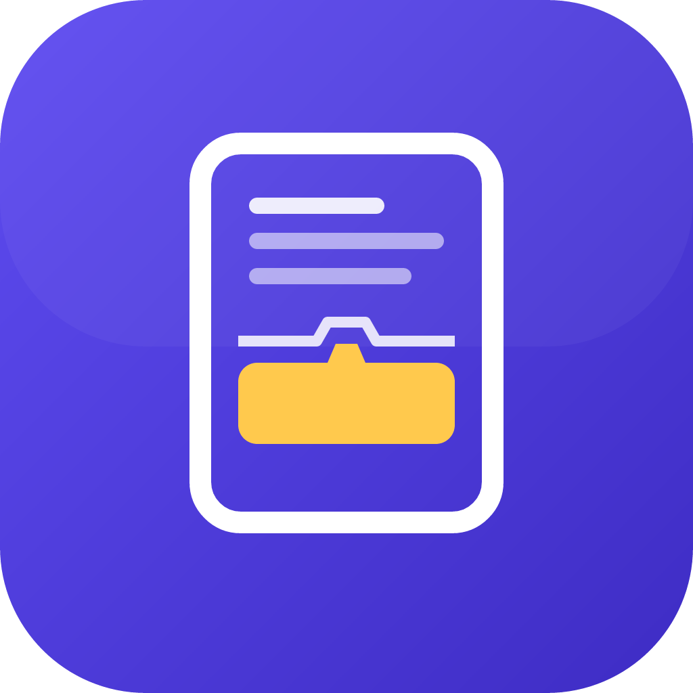
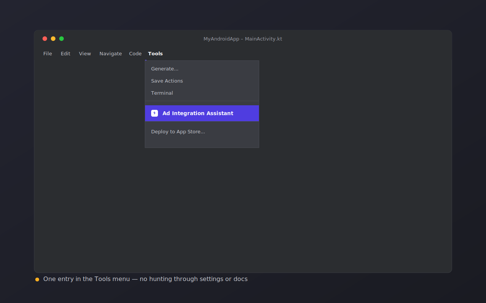
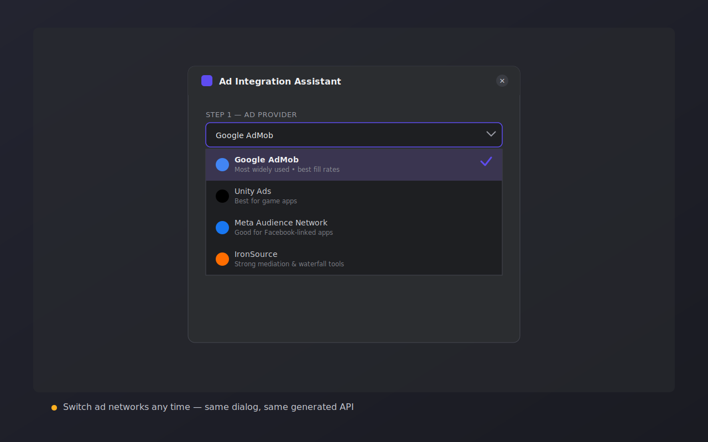
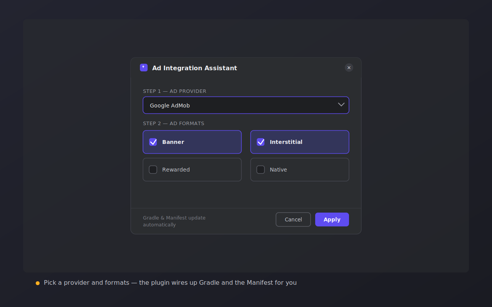
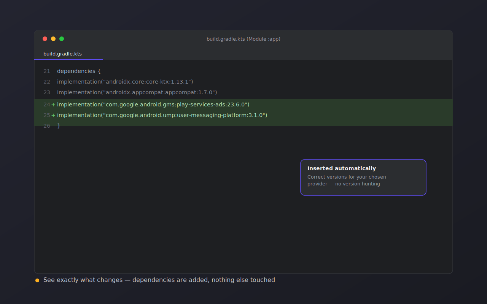
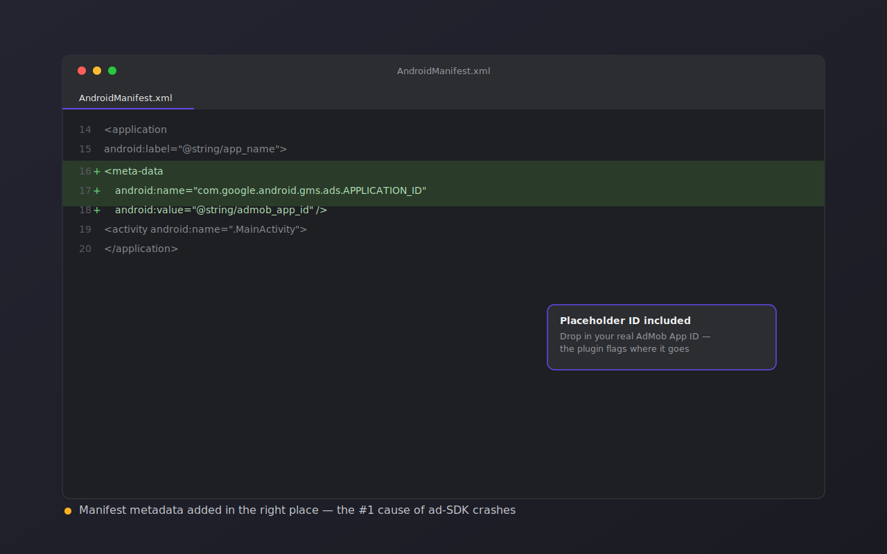
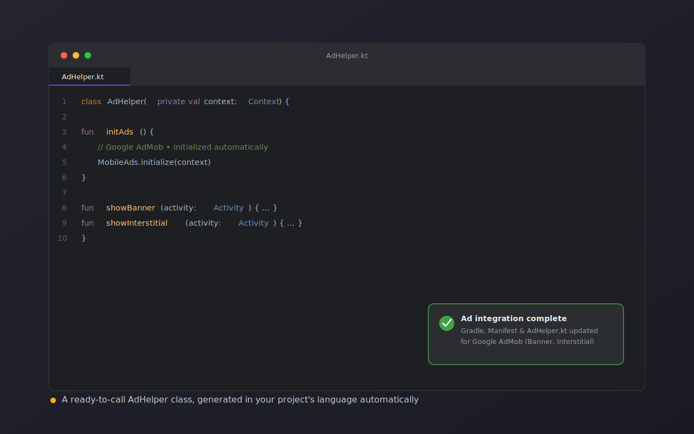

<p align="center">
  
</p>

<h1 align="center">Ad Integration Pro</h1>

<p align="center">
  Add AdMob, Unity Ads, Meta Audience Network, or IronSource to your Android app<br/>
  in one guided dialog — no manual Gradle edits, no Manifest tweaks, no boilerplate.
</p>

<p align="center">
  <a href="https://plugins.jetbrains.com/plugin/28580-ad-integration-pro"></a>
  <a href="https://plugins.jetbrains.com/plugin/28580-ad-integration-pro"></a>
  
  
</p>


<p align="center">
  <a href="https://plugins.jetbrains.com/plugin/28580-ad-integration-pro">
    
  </a>
</p>

---

<details open>
<summary><strong>📚 Table of Contents</strong></summary>
<br>

<table>
<tr>
<td width="50%" valign="top">

**🚀 Getting Started**
- 🎯 [Why this exists](#why-this-exists)
- 🖼️ [Screenshots](#screenshots)
- ⚙️ [Features](#features)
- 💰 [Free vs. Pro](#free-vs-pro)

</td>
<td width="50%" valign="top">

**🔧 Using the Plugin**
- 📦 [Installation](#installation)
- 🛠️ [How to use](#how-to-use)
- 💻 [Example usage](#example-usage)
- 🔍 [What actually changes in your project](#what-actually-changes-in-your-project)

</td>
</tr>
<tr>
<td width="50%" valign="top">

**📖 Reference**
- ✅ [Requirements](#requirements)
- ❓ [FAQ](#faq)
- 🗺️ [Roadmap](#roadmap)

</td>
<td width="50%" valign="top">

**🤝 Community**
- 💬 [Support](#support)
- 🧩 [Contributing](#contributing)
- 📄 [License](#license)

</td>
</tr>
</table>

</details>

---

## Why this exists

Wiring up an ad SDK by hand is the same tedious sequence every time:

1. Find the current setup guide for whichever network you're integrating (AdMob, Unity Ads, Meta, IronSource — each with its own docs, own quirks, own version numbers)
2. Add the right Gradle dependency, hope you copied the version number correctly
3. Edit `AndroidManifest.xml` with the exact `<meta-data>` block the SDK expects, in the exact right place
4. Write an `initAds()` / `showBanner()` / `showInterstitial()` wrapper class, because you don't want SDK calls scattered across your Activities
5. Repeat all of the above for the next project

None of that is hard individually. It's just slow, easy to get slightly wrong, and boring to do more than once. Ad Integration Pro collapses all four steps into one dialog: pick a network, pick your formats, click **Apply**.

## Screenshots

| | |
|---|---|
|  |  |
| One entry in the Tools menu | All 4 networks, one dropdown |
|  |  |
| Pick the ad formats you need | See exactly what's added to Gradle |
|  |  |
| Manifest metadata inserted correctly | A ready-to-call `AdHelper` class |


## Features

- **Multi-provider support** — Google AdMob, Unity Ads, Meta Audience Network, IronSource
- **All the standard ad formats** — Banner, Interstitial, Rewarded, Native
- **Automatic project setup**
  - Gradle dependencies inserted for you, correct versions, no version hunting
  - `AndroidManifest.xml` updated with the required permissions and metadata, in the right place
- **A ready-to-call helper class** — generates `AdHelper.java` or `AdHelper.kt`, matching your project's existing language automatically (it detects which one your project already uses)
- **One consistent API, regardless of provider** — switch from AdMob to IronSource later without rewriting your Activity code:
```
initAds()
showBanner()
showInterstitial()
showRewarded()
showNative()
```

- **Non-destructive** — the plugin only adds to your Gradle file and Manifest; it never deletes or rewrites existing entries

## Free vs. Pro

Ad Integration Pro is **freemium**: AdMob support is fully free, forever. A Pro tier unlocks the other three networks.

<div align="center">

| | Free | Pro |
|---|:---:|:---:|
| Google AdMob | ✅ | ✅ |
| Banner ads | ✅ | ✅ |
| Interstitial ads | ✅ | ✅ |
| Automatic Gradle setup | ✅ | ✅ |
| Automatic Manifest setup | ✅ | ✅ |
| Java / Kotlin helper generation | ✅ | ✅ |
| Unity Ads | ❌ | ✅ |
| Meta Audience Network | ❌ | ✅ |
| IronSource | ❌ | ✅ |
| Rewarded ads | ❌ | ✅ |
| Native ads | ❌ | ✅ |

</div>
If you only need AdMob banners and interstitials, the free tier does everything you need — there's no trial period or time limit on it.

## Installation

**From JetBrains Marketplace**
1. Open Android Studio or IntelliJ IDEA
2. Go to **File → Settings → Plugins → Marketplace**
3. Search for **Ad Integration Pro**
4. Click **Install**, then restart the IDE

## How to use

1. Open your Android project
2. Go to **Tools → Ad Integration Assistant**
3. Choose your ad network — AdMob, Unity Ads, Meta, or IronSource
4. Choose the ad formats you need — Banner, Interstitial, Rewarded, Native
5. Click **Apply**

The plugin then:
- Adds the required Gradle dependencies
- Updates `AndroidManifest.xml`
- Generates `AdHelper.java` or `AdHelper.kt`, ready to call

## Example usage

**Kotlin**
```kotlin
class MainActivity : AppCompatActivity() {
    private lateinit var adHelper: AdHelper

    override fun onCreate(savedInstanceState: Bundle?) {
        super.onCreate(savedInstanceState)
        setContentView(R.layout.activity_main)

        adHelper = AdHelper(this)
        adHelper.initAds()
        adHelper.showBanner(this)
    }
}
```

**Java**
```java
public class MainActivity extends AppCompatActivity {
    private AdHelper adHelper;

    @Override
    protected void onCreate(Bundle savedInstanceState) {
        super.onCreate(savedInstanceState);
        setContentView(R.layout.activity_main);

        adHelper = new AdHelper(this);
        adHelper.initAds();
        adHelper.showBanner(this);
    }
}
```

## What actually changes in your project

Being upfront about this, since "a plugin edits my build files automatically" is the kind of thing you want to verify before trusting it:

- **`build.gradle` / `build.gradle.kts`** — one or two `implementation(...)` lines are appended inside your existing `dependencies { }` block. Nothing already there is modified or removed.
- **`AndroidManifest.xml`** — a `<meta-data>` entry is added inside `<application>`, with a placeholder value (e.g. your AdMob App ID) that you fill in with your real credentials afterward.
- **A new file** — `AdHelper.kt` or `AdHelper.java` is created in your project; no existing source files are touched.

You can always review the diff in your IDE / version control before committing, same as any other automated change.

## Requirements

- Android Studio or IntelliJ IDEA 2023.1+
- Minimum Android SDK 21

## FAQ

**Does this plugin show ads in my app, or just help me set up the SDK?**
It sets up the SDK integration (dependencies, Manifest, helper class). You still need your own ad unit IDs from your AdMob/Unity/Meta/IronSource account, and you're responsible for complying with each network's policies.

**Will switching ad formats later break anything?**
No — re-running **Tools → Ad Integration Assistant** with different formats selected only adds what's missing; it won't remove formats you already have configured.

**Can I use more than one ad network in the same app?**
Yes, run the assistant once per network. Each generates its own set of dependencies; you'll just have two `AdHelper` classes (or extend one to route between them) if you do this.

**What happens to the free tier if I don't buy Pro?**
Nothing changes — AdMob support keeps working exactly as it does today. Nothing free becomes locked later.

## Roadmap

- [ ] Real (non-stub) SDK call generation inside `AdHelper` for all four networks
- [ ] Mediation waterfall configuration for IronSource
- [ ] Jetpack Compose helper variant (`@Composable` ad slots)
- [ ] One-click "remove ad network" cleanup action

Have a request that's not listed here? Open an issue — see [Support](#support).

## Support

Questions, issues, or feature requests:
📧 [chaudharysantosh03k@gmail.com](mailto:chaudharysantosh03k@gmail.com)
🐛 [Open an issue](../../issues)

## Contributing

Issues and pull requests are welcome. If you're proposing a larger change (a new ad network, a new format), open an issue first so we can align on approach before you put in the work.

## License

Licensed under the [Apache License 2.0](./LICENSE).
